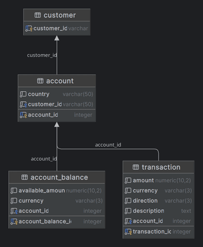

# account-application

This application provides a small core banking solution to keep track of current accounts, balances, and transaction
history and the capability to publish messages into RabbitMQ for downstream consumers.
-----

## Requirements:

- Java 17
- SpringBoot 3
- MyBatis 3
- Gradle 8.4
- Postgres 16.2
- RabbitMQ 3.13.0
- Docker 25
- JUnit
- Jacoco (Test coverage 80%)
- Currently, only tested on Fedora 39 and IntelliJ IDEA

## How to run:

- `cd account-application`
- `gradle clean build`
- `gradle bootRun`

## Run with Docker:

#### Using the existing JAR file:

- `cd account-application`
- `docker build --no-cache --build-arg JAR_FILE=account-application.jar -t renvl/account-application .`
- `docker run -p 8080:8080 -t renvl/account-application`

#### Compiling the application:

- `cd account-application`
- `gradle clean build`
- `docker build --no-cache --build-arg JAR_FILE=build/libs/\*.jar -t renvl/account-application .`
- `docker run -p 8080:8080 -t renvl/account-application`

## Running using Docker Compose:

- `docker-compose -f docker-compose.yml up`

## API:

http://localhost:8080/api Endpoint.

#### /accounts/v1/:id

* `GET` : Get an Account by ID

#### /accounts/v1/

* `POST` : Create a new account

#### /transactions/v1/:id

* `GET` : Get all transactions by Account ID

#### /transactions/v1/

* `POST` : Create a new transactions for an Account

http://localhost:8080/swagger-ui/index.html Swagger-UI formatted documentation.

NB!, in the API documentation pages, documentations for POST and GET requests for the account-application can be seen.
Moreover, in Swagger UI for example, making a query is quite easy with example formats.

## Database Design

## RabbitMQ Integration

http://localhost:15672 RabbitMQ Management UI

## Parametrization:

To connect Postgres and RabbitMQ use the properties according
to [application.properties](src/main/resources/application.properties)

## License

account-application is distributed under the terms of the
[MIT License](https://choosealicense.com/licenses/mit).
